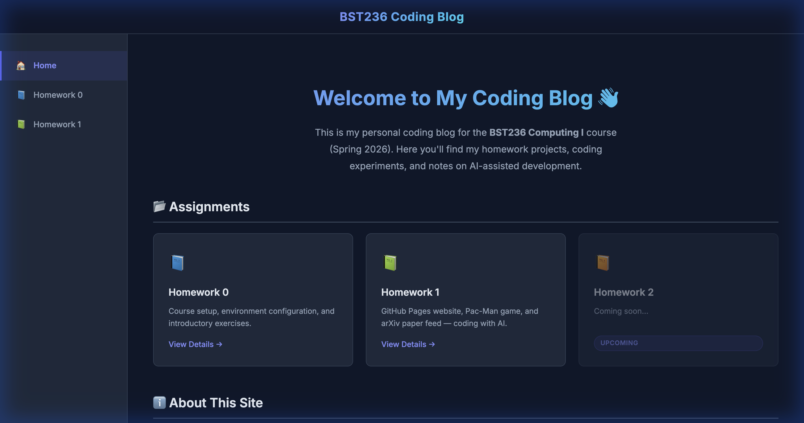
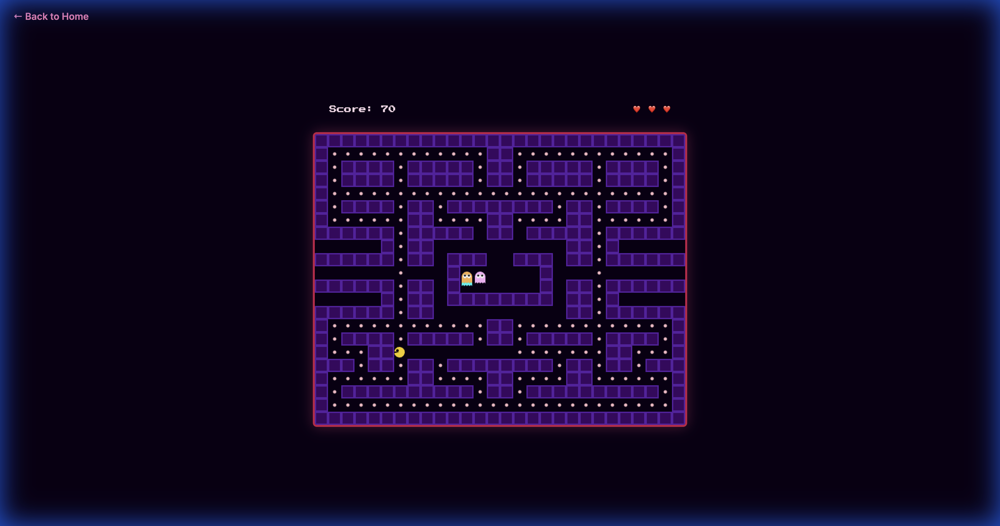

# BST236 Computing I - Homework 1

## Introduction
This repository contains the code for **Homework 1** of the **BST236 Computing I** course (Spring 2026). The primary goal of this assignment is to practice **AI-assisted programming** using tools like GitHub Copilot to build web applications and automate workflows.

The repository is organized into three main problems:
1.  **Problem 1: GitHub Website** - A personal coding blog hosted on GitHub Pages, serving as the central hub for course assignments.
2.  **Problem 2: Pac-Man Game** - A browser-based Pac-Man game with a Valentine's Day theme, featuring AI-generated ghosts and game logic.
3.  **Problem 3: ArXiv Fetching** - An auto-updating feed of scientific papers (Work in Progress).

All code and assets were developed with significant assistance from AI agents, demonstrating the "Agentic Workflow" paradigm.

## Installation

To set up and run the code locally, follow these steps:

### 1. Clone the Repository
Open your terminal and run the following command to clone the repository to your local machine:

```bash
git clone https://github.com/ytian820/BST236_HW1.git
cd BST236_HW1/homework-1-ytian820
```


### 2. Dependencies
This project consists primarily of static HTML, CSS, and JavaScript files.
*   **No backend installation** (Node.js, Python, etc.) is required to run the website or game.
*   A modern web browser (Chrome, Safari, Firefox, Edge) is required.


## Usage

You can run the projects directly by opening the HTML files in your browser.

### 1. Coding Blog Website (Problem 1)
Locate and open the `Problem_1_Github_website/index.html` file in your browser.

*   **Homepage**: Displays an overview of assignments.
*   **Navigation**: Use the sidebar to navigate between Home, Homework 0, and Homework 1.



### 2. Pac-Man Game (Problem 2)
To play the game, navigate to the **Homework 1** page on the website and click **"Play Now"**, or open `Problem_2_Pac_man/pacman.html` directly.

*   **Controls**: Use Arrow Keys (⬆️, ⬇️, ⬅️, ➡️) to move Pac-Man.
*   **Objective**: Eat all dots and avoid the ghosts.
*   **Special Feature**: Collect the "Rose" power-up to turn ghosts into edible hearts! 💘




## Report

### 1. overview
This project was developed using an **Agentic Workflow**, where I acted as the orchestrator and utilized AI tools (GitHub Copilot, Large Language Models) to handle implementation details, debugging, and content generation.

### 2. AI Tools Used
*   **AI Coding Agent**: Used for complex task planning, multi-file refactoring, and automated bug fixing.

### 3. Problem 1: Coding Blog Website
 To build the website, I first asked chatGPT how to build a github page and what the file structure should look like. During this process, I learned the basic ideas of github pages and how to use it to host a website. 
 
 After getting familiar with the basic concepts, I started to plan the structure of the website. I decided to create a multi-page portfolio with a fixed sidebar navigation and a main content area. I spent some time designing the webpage. 
 
 After finalizing my design, I asked the agent (claude) to generate a TODO.md which lists all the steps to build a github webpage step-by-step. The TODO list generated is in the folder Problem_1_Github_website and can be accessed here: [Problem 1 TODO List](Problem_1_Github_website/TODO.md) 

 Then, I spent some time modifying the TODO list and refining the content. I noticed some errors and fixed them. After that, I asked the agent to generate the code and files in the project folder, which include html files and css files. This gave me an initial webpage.

 I noticed some bugs for this github webpage, so I wrote down the bugs and asked the agent to fix them. The agent fixed the bugs and gave me a new version of the webpage. I repeated this process until I was satisfied with the webpage.
 


### 4. Problem 2: Pac-Man Game (Valentine's Special)
In this problem, I implemented a fully functional Pac-Man game with custom mechanics using HTML Canvas and JavaScript. The goal was not only to reproduce the core gameplay of the classic Pac-Man, but also to extend it with a creative Valentine-themed power-up feature. Throughout the implementation process, I adopted an agentic programming approach using AI assistance to scaffold, iterate, and refine different components of the game.

I began by prompting the AI to generate a standard Pac-Man game structure using HTML Canvas. The objective at this stage was to establish a solid foundational architecture, including the game loop, entity classes (Pac-Man, Ghost, Maze, Pellet), collision detection logic, and rendering pipeline. By explicitly instructing the AI to focus on modular class design and a clear update–render cycle, I were able to obtain a clean separation between game state updates and drawing logic. This initial scaffolding significantly accelerated development and provided a structured baseline for further customization.

To satisfy the homework requirement of adding a Valentine-themed mechanic, I introduced a custom “Rose” power-up system. Instead of modifying the entire game logic at once, I used a targeted prompt strategy. Specifically, I instructed the AI to add a new Rose item such that when Pac-Man eats it, he enters a temporary powered-up state and continuously shoots heart projectiles in the direction he is facing. The AI generated a Rose class and implemented a shootHeart function, along with a timed power-up state variable. I then manually reviewed and refined the timing logic to ensure the power-up expired correctly and that heart projectiles interacted properly with ghost entities. This modular extension approach allowed me to integrate the new feature without disrupting the original game loop.

During testing, I encountered a critical bug where ghosts would occasionally become stuck inside the central “Ghost House” and fail to exit. Rather than manually tracing the entire codebase, I adopted an agent-assisted debugging workflow. I first provided a concise problem description to the AI: “Ghosts are not leaving the start area.” The AI analyzed the movement logic and suggested adding debug logs to trace ghost state transitions. Through this process, I identified that the random movement logic was trapping ghosts due to insufficient directional escape conditions. To resolve this, the AI proposed introducing an explicit inGhostHouse state flag that forces ghosts to move upward until they exit the starting enclosure. After implementing this state transition constraint, I verified the fix using visual trace logs and confirmed that ghost behavior returned to the intended chasing pattern.

Overall, this problem demonstrated how agent-assisted development can support both rapid prototyping and structured debugging. Instead of generating the entire project in a single pass, I decomposed the implementation into modular steps: initial scaffolding, feature extension, and targeted debugging. This iterative workflow improved code clarity, preserved modularity, and made the system easier to reason about. The final game preserves the recognizable Pac-Man mechanics—maze navigation, pellet collection, ghost chasing, life tracking—while incorporating the Valentine-themed rose power-up and heart projectile system as a creative extension.

### 5. Problem 3: ArXiv Paper Feed (Planned)
*   **Strategy**: I plan to use **GitHub Actions** to schedule a daily script.
*   **Tools**: `actions/checkout` and Python scripts using the `arxiv` API.
*   **(Report to be updated upon completion)**

## Contributions
*   **Yuan Tian**: Project setup, Website design, Pac-Man game implementation, and Report writing.

